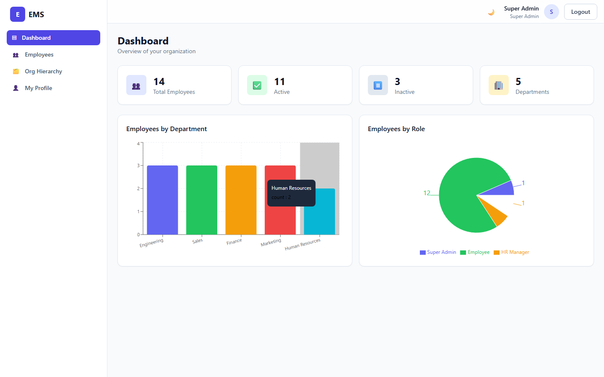
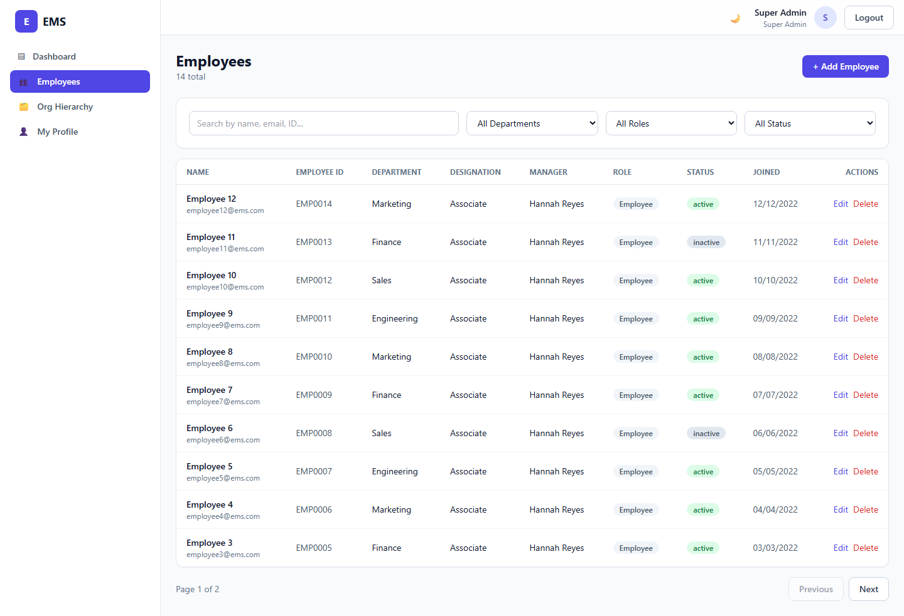
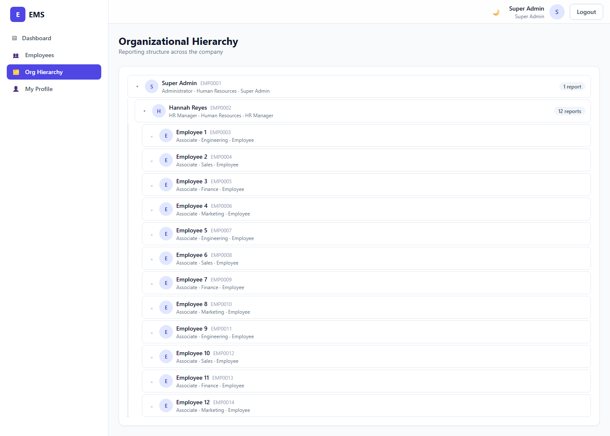

# Employee Management System (EMS)

A full-stack Employee Management System with secure JWT authentication, role-based
access control, employee CRUD, organizational hierarchy (with circular-reporting
prevention), a charted dashboard, search/filter/sort, and dark mode.

> Built for the Full Stack Developer hiring assignment.

## ✨ Features

**Authentication**
- Login / logout with **JWT** (httpOnly cookie + Bearer fallback) and **bcrypt** password hashing
- Protected routes on both frontend (route guard) and backend (middleware)

**Role-Based Access Control** — `Super Admin`, `HR Manager`, `Employee`
- **Super Admin** — full access: CRUD, assign roles & managers, delete
- **HR Manager** — create / edit / view employees; **cannot delete** or assign Super Admin
- **Employee** — view & edit **own** profile only (name, phone, password, image)

**Dashboard** — total / active / inactive employees, department count, plus bar & pie **charts**

**Employee Management** — CRUD with Employee ID, Name, Email, Phone, Department,
Designation, Salary, Joining Date, Status, Role, Reporting Manager, Profile Image

**Organizational Hierarchy** — assign reporting manager, collapsible reporting tree,
direct-reports view, and **circular-reporting prevention** (self & descendant checks)

**Search / Filter / Sort** — search by name/email/ID, filter by department/role/status,
sort by name & joining date, with **pagination**

**Validation** — client-side (Zod + React Hook Form) and server-side (express-validator)

**Bonus included** — pagination · soft delete · dashboard charts · dark mode · Docker ·
CSV import · unit tests (24 Jest tests) · seed script · zero-setup in-memory dev mode

## 🧱 Tech Stack

| Layer | Tech |
|-------|------|
| Frontend | Next.js 14 (App Router), TypeScript, Tailwind CSS, Recharts, React Hook Form, Zod, Axios |
| Backend | Node.js, Express, TypeScript |
| Database | MongoDB + Mongoose |
| Auth | JWT (jsonwebtoken) + bcryptjs |
| Testing | Jest + Supertest + mongodb-memory-server |
| Tooling | Docker / docker-compose |

## 📁 Structure

```
full-stack/
├── backend/         Express + MongoDB API (TypeScript)
│   ├── src/{config,models,controllers,routes,middleware,validators,utils,types}
│   └── tests/       Jest + Supertest (auth, RBAC, CRUD, hierarchy)
├── frontend/        Next.js 14 app (TypeScript, Tailwind)
│   └── src/{app,components,lib}
├── docs/            API.md + screenshots
└── docker-compose.yml
```

---

## 🚀 Getting Started

### Option A — Docker (everything, one command)
```bash
docker compose up --build
```
- Frontend → http://localhost:3000
- Backend  → http://localhost:5000
- MongoDB  → localhost:27017

> After the first boot, seed demo data (see [Seeding](#-seeding)) or use CSV import.

### Option B — Zero-setup dev (no MongoDB install needed)
The backend can boot an **in-memory MongoDB** and auto-seed demo data — ideal for a quick look:
```bash
cd backend
npm install
npm run dev:mem       # API + seeded data on http://localhost:5000
```
In a second terminal:
```bash
cd frontend
npm install
npm run dev           # http://localhost:3000
```

### Option C — Local with your own MongoDB
```bash
# 1. Backend
cd backend
cp .env.example .env          # adjust MONGO_URI / JWT_SECRET if needed
npm install
npm run seed                  # create Super Admin + demo employees
npm run dev                   # http://localhost:5000

# 2. Frontend
cd ../frontend
cp .env.example .env.local
npm install
npm run dev                   # http://localhost:3000
```

### 🔑 Demo accounts (after seeding)
| Role | Email | Password |
|------|-------|----------|
| Super Admin | `admin@ems.com` | `Admin@123` |
| HR Manager | `hr@ems.com` | `Admin@123` |
| Employee | `employee1@ems.com` | `Admin@123` |

The login screen has one-click buttons to fill each demo account.

---

## 🌱 Seeding
```bash
cd backend
npm run seed     # wipes + creates 1 Super Admin, 1 HR, and ~23 employees with a hierarchy
```
Configure the Super Admin via `.env` (`SEED_ADMIN_EMAIL`, `SEED_ADMIN_PASSWORD`, `SEED_ADMIN_NAME`).

## 🧪 Tests
```bash
cd backend
npm test
```
Runs 24 tests against an in-memory MongoDB covering auth, RBAC (every role boundary),
employee CRUD + search/filter/sort/pagination, dashboard stats, soft delete, reportees,
the reporting tree, and **circular-reporting prevention**.

## 📚 API
Full endpoint reference in **[docs/API.md](docs/API.md)**. Endpoints implemented:

```
POST   /api/auth/login
POST   /api/auth/logout
GET    /api/auth/me
GET    /api/employees                 (search, filter, sort, pagination)
POST   /api/employees
GET    /api/employees/:id
PUT    /api/employees/:id
DELETE /api/employees/:id             (soft delete, super_admin)
GET    /api/employees/stats           (dashboard)
POST   /api/employees/import          (CSV, bonus)
GET    /api/organization/tree
GET    /api/employees/:id/reportees
PATCH  /api/employees/:id/manager
GET    /api/health
```

## 🖼 Screenshots
See [`docs/screenshots/`](docs/screenshots). Dashboard, employees table, org tree,
employee form, profile, and dark mode.

| Dashboard | Employees | Org Hierarchy |
|-----------|-----------|---------------|
|  |  |  |

## 🔒 Security notes
- Passwords hashed with bcrypt (never returned; `passwordHash` is `select: false` and stripped in `toJSON`).
- JWT stored in an httpOnly cookie; `SameSite`/`Secure` configurable via env for production.
- RBAC enforced server-side (route middleware) — the UI hides actions but the API is the source of truth.
- Field-level restriction for the Employee role is enforced on the backend, not just the UI.

## 🚢 Deployment (bonus)
- **Backend** → any Node host (Render / Railway / Fly). Set `MONGO_URI` (e.g. MongoDB Atlas),
  `JWT_SECRET`, `CLIENT_URL`, and `COOKIE_SECURE=true`.
- **Frontend** → Vercel. Set `NEXT_PUBLIC_API_URL` to the deployed API URL.
- Or ship both with the provided `docker-compose.yml`.

## 📝 License
MIT — built for assignment/demo purposes.
